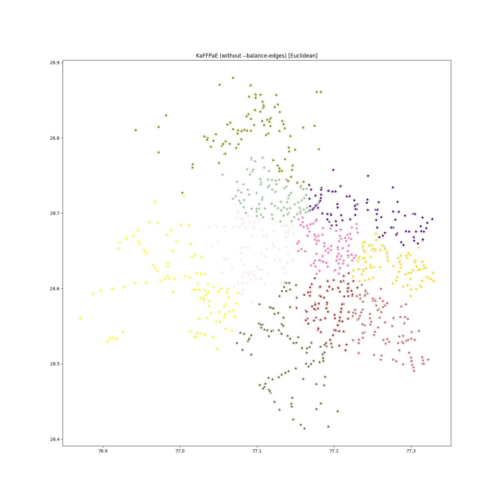
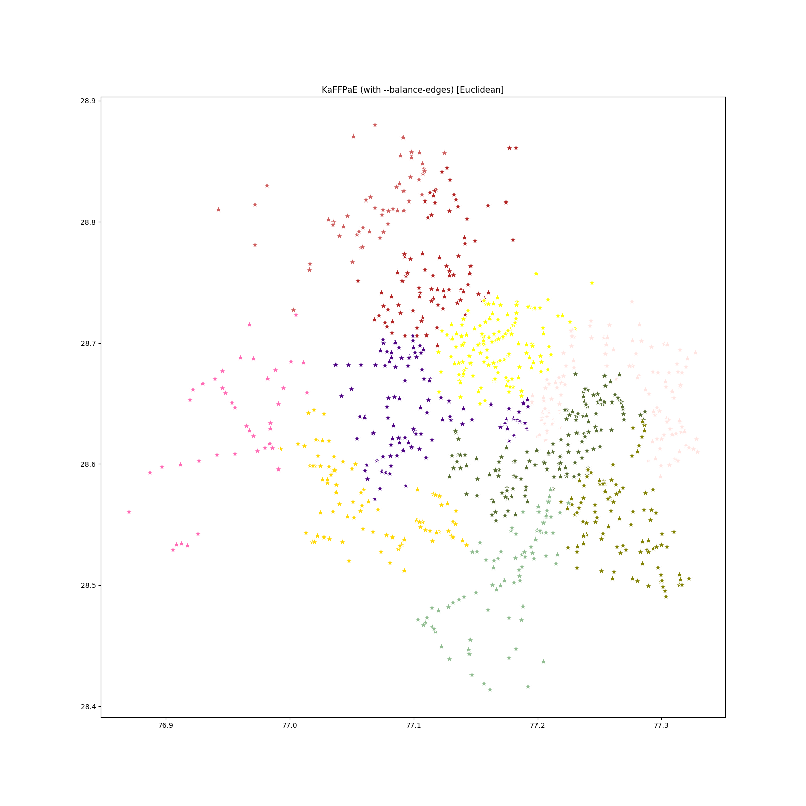
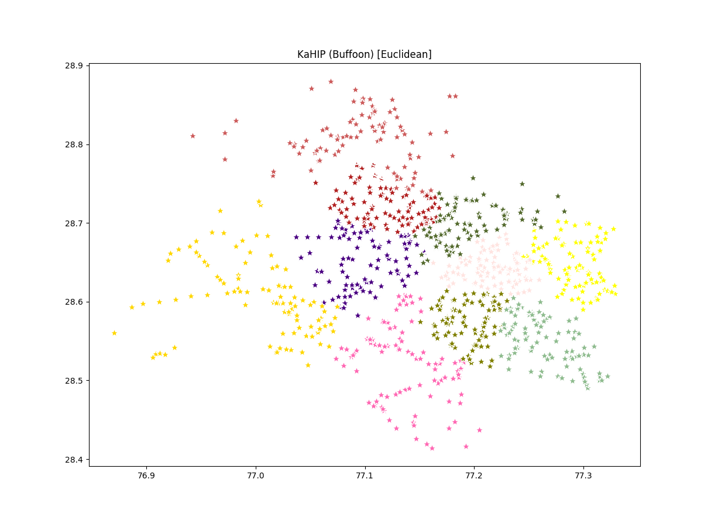

Cluster Locations Using KahIP
=============================

**Requirements**

`KaHIP Python Wrapper <https://github.com/suriyan/KaHIP/tree/master/misc/python>`__. There is pre-built binary (Wheel) for Python 2.7 Linux x86_64:

::

    pip install -U https://github.com/suriyan/KaHIP/raw/master/misc/python/dist/kahipwrapper-0.1.1-cp27-cp27mu-linux_x86_64.whl

Unfortunately, code for KaHIP with Buffoon is not public due to a pending US software patent.

For more information please visit KaHIP main site `here <http://algo2.iti.kit.edu/kahip/>`__ and the public version also available on GitHub `here <https://github.com/schulzchristian/KaHIP/>`__.

Specify ``--buffoon`` to use Buffoon algorithm instead of KaFFPaE. You must also specify the directory in which KaHIP with Buffoon is stored. Use ``--kahip-dir`` (default is ``./KaHIP/src``) for that.

**Usage**

::

    usage: cluster_kahip.py [-h] [--kahip-dir KAHIP_DIR] [--buffoon]
                            [--n-closest N_CLOSEST] [-s SEED] -n N_WORKERS
                            [-o OUTPUT] [-d {euclidean,haversine,osrm,google}]
                            [--plot] [--save-plot SAVE_PLOT] [--balance-edges]
                            [--osrm-base-url OSRM_BASE_URL]
                            [--osrm-max-table-size OSRM_MAX_TABLE_SIZE]
                            [--api-key API_KEY]
                            input

    Allocator by Karlsruhe High Quality Partitioning (KaHIP)

    positional arguments:
    input                 Road segments input file

    optional arguments:
    -h, --help            show this help message and exit
    --kahip-dir KAHIP_DIR
                            KaHIP directory (Buffoon version)
    --buffoon             Using Buffoon
    --n-closest N_CLOSEST
                            Number of closest nodes to build graph
    -s SEED, --seed SEED  Random seed for KaHIP
    -n N_WORKERS, --n-workers N_WORKERS
                            Number of workers
    -o OUTPUT, --output OUTPUT
                            Output file name
    -d {euclidean,haversine,osrm,google}, --distance-func {euclidean,haversine,osrm,google}
                            Distance function for distance matrix
    --plot                Plot the output
    --save-plot SAVE_PLOT
                            Save plotting to file
    --balance-edges       KaFFPaE with balance edges
    --osrm-base-url OSRM_BASE_URL
                            Custom OSRM service URL
    --osrm-max-table-size OSRM_MAX_TABLE_SIZE
                            Maximum OSRM table size
    --api-key API_KEY     Google Map API Key

**Examples**

Using KaFFPaE without balanced edges:

::

    python -m allocator.cluster_kahip -n 10 -s 0 --save-plot allocator/examples/KaHIP/KaFFPaE-without-balance-edges.png -o allocator/examples/KaHIP/delhi-kaffpae-without-balance-edges-output.csv allocator/examples/delhi-roads-1k.csv

Using KaFFPaE with balanced edges:

::

    python -m allocator.cluster_kahip -n 10 -s 0 --balance-edges --save-plot allocator/examples/KaHIP/KaFFPaE-balance-edges.png -o allocator/examples/KaHIP/delhi-kaffpae-balance-edges-output.csv allocator/examples/delhi-roads-1k.csv

Using KaHIP Buffoon:

::

    python -m allocator.cluster_kahip -n 10 -s 0 --buffoon --save-plot allocator/examples/KaHIP/KaHIP-Buffoon.png -o allocator/examples/KaHIP/delhi-kahip-buffoon-output.csv allocator/examples/delhi-roads-1k.csv

