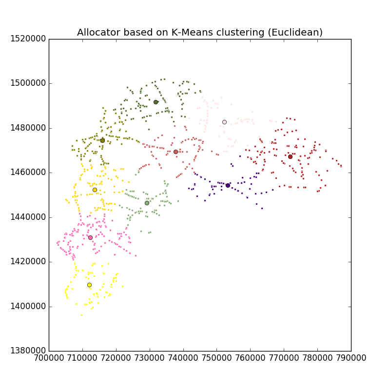

Cluster Locations Using K-Means
===============================

The function takes a CSV of data collection locations and clusters locations into ``n`` groups, where ``n`` is specified by the user. ``n`` can be ``n_workers``, ``n_workers*n_days`` etc. The function uses k-means to cluster the locations, and defaults to the euclidean distance matrix.

**Input:**

- ``n`` or number of clusters
- A CSV file containing the lat/longs of the remaining points. For instance, output of `geo_sampling <https://github.com/soodoku/geo_sampling>`__ with a few adjustments can work. The `geo_sampling` script produces a list of segments with a start and an end lat/long of each segment. Pick the start or end lat/long and rename columns so that they are 3 columns with names: id, lat, long
- Distance function: ``-d euclidean``, ``-d haversine`` or ``-d osrm``. *Default* is ``-d euclidean``.
- Name of the output file. Default is ``cluster-kmeans-output.csv``
    
**Output:**

- Appends a new column ``assigned_points`` that gives cluster assignment for each row of the lat/long file. The column takes integer values: ``1, 2, 3, ....n``

**Usage:**

::

    usage: cluster_kmeans.py [-h] -n N_WORKERS [-m MAX_ITER]
                            [-d {euclidean,haversine,osrm}] [-c CENTROIDS]
                            [-o OUTPUT] [-r RANDOM_STATE] [--plot]
                            [--osrm-base-url OSRM_BASE_URL]
                            [--osrm-max-table-size OSRM_MAX_TABLE_SIZE]
                            input

    Random allocator based on K-Means clustering

    positional arguments:
      input                 Road segments input file

    optional arguments:
      -h, --help            show this help message and exit
      -n N_WORKERS, --n_workers N_WORKERS
                            Number of workers
      -m MAX_ITER, --max_iter MAX_ITER
                            Maximum number of iterations
      -d {euclidean,haversine,osrm}, --distance-func {euclidean,haversine,osrm}
                            Distance function for distance matrix
      -c CENTROIDS, --centroids CENTROIDS
                            Output file name of K-Means centroids
      -o OUTPUT, --output OUTPUT
                            Output file name
      -r RANDOM_STATE, --random-state RANDOM_STATE
                            Random state
      --plot                Plot the output
      --osrm-base-url OSRM_BASE_URL
                            Custom OSRM service URL
      --osrm-max-table-size OSRM_MAX_TABLE_SIZE
                            Maximum OSRM table size

    
**Examples:**

::

    python -m allocator.cluster_kmeans -n 10 allocator/examples/chonburi-roads-1k.csv --plot

Output file will be saved as :download:`cluster-kmeans-output.csv <../../allocator/examples/kmeans/cluster-kmeans-output.csv>` if a different name is not specified by ``-o/--output``. K-means centroids will be saved as :download:`cluster-kmeans-centroids-output.csv <../../allocator/examples/kmeans/cluster-kmeans-centroids-output.csv>` if another name is not specified by ``-c/--centroids``

To see the plot, please specify ``--plot``

