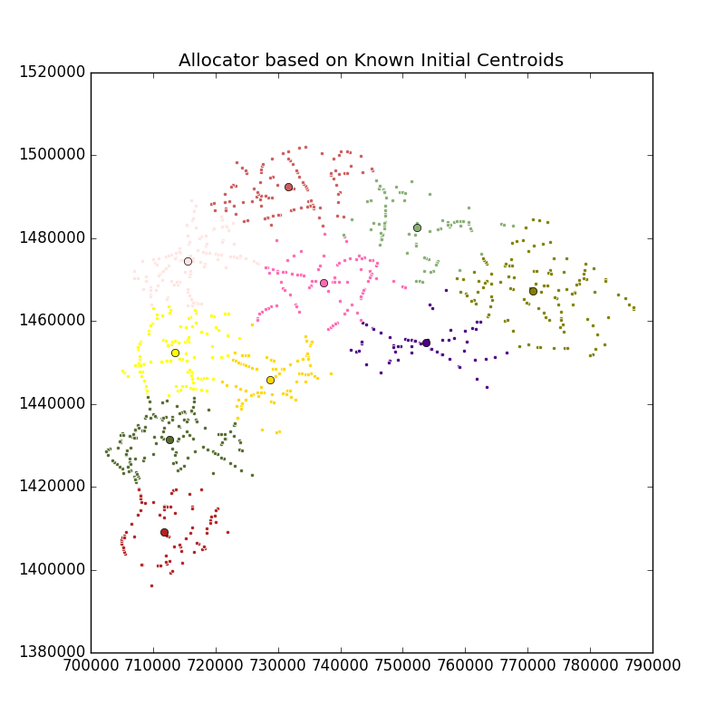

Sort By Distance
======================

The function takes workers' current locations and a file containing lat/long of locations and does one of two things:

1. Produces an ordered list of workers for each location---ordered by proximity to the location, closest to furthest. An administrator could use the ordered list to propose other workers if the most proximate worker can't go a particular location.

2. Produces an ordered list of locations by worker---ordered by proximity to the worker. The ordered list works as a simple recommendation engine---suggest other locations that a worker could collect data from.

**Note.** If 2 or more workers/locations are equally far away, the order is assigned randomly.

**Input:**

- A CSV file containing the lat/longs of the remaining points. For instance, output of `geo_sampling <https://github.com/soodoku/geo_sampling>`__ with a few adjustments can work. The geo_sampling script produces a list of segments with a start and an end lat/long of each segment. Pick the start or end lat/long and rename columns so that they are 3 columns like below.
- A CSV file containing initial_location for workers. Must have three columns with names: ``lat``, ``long``
- `by_worker` flag. If the `by_worker` flag is included, the script produces an ordered list of locations by worker. *Default:* ordered list of workers by location. 
- Distance function: ``-d euclidean``, ``-d haversine`` or ``-d osrm``. *Default* is ``-d euclidean``.
- Name of the output file. Default is ``sort-by-distance-output.csv``

**Output:**

- By Default (if ``--by_worker`` flag is not planted), it appends to the location CSV ``n + 1`` (``n = n_workers``) new columns. The first n column contains distance between the location and the n'th worker. The last column contains a semi-color separated ordered list of workers.

- If the ``--by_worker`` flag is planted, it appends to the worker CSV ``k + 1`` (``k = n_locations``) new columns. The first k column contains distance between the worker and the k'th location. The last column contains a semi-color separated ordered list of locations.

**Usage:**

::

    usage: sort_by_distance.py [-h] -c CENTROIDS [-o OUTPUT]
                              [-d {euclidean,haversine,osrm,google}] [--plot]
                              [--by-worker] [--osrm-base-url OSRM_BASE_URL]
                              [--osrm-max-table-size OSRM_MAX_TABLE_SIZE]
                              [--api-key API_KEY]
                              input

    Known initial centroids allocator

    positional arguments:
      input                 Road segments input file

    optional arguments:
      -h, --help            show this help message and exit
      -c CENTROIDS, --centroids CENTROIDS
                            Known locations of the workers
      -o OUTPUT, --output OUTPUT
                            Output file name
      -d {euclidean,haversine,osrm,google}, --distance-func {euclidean,haversine,osrm,google}
                            Distance function for distance matrix
      --plot                Plot the output
      --by-worker           Alternative output format by worker
      --osrm-base-url OSRM_BASE_URL
                            Custom OSRM service URL
      --osrm-max-table-size OSRM_MAX_TABLE_SIZE
                            Maximum OSRM table size
      --api-key API_KEY     Google Map API Key

**Examples**

::

  python -m allocator.sort_by_distance -c allocator/examples/sort-by-distance/worker-locations.csv allocator/examples/chonburi-roads-1k.csv --plot

The script takes a CSV file with worker locations (see :download:`a sample file <../../allocator/examples/sort-by-distance/worker-locations.csv>`) that contains two columns, ``lat`` (latitude) and ``lon`` (longitude).

Output file will be saved as :download:`sort-by-distance-output.csv <../../allocator/examples/sort-by-distance/sort-by-distance-output.csv>` if not specified by ``-o/--output``

To see the plotting please specify `--plot`

If ``--by_worker`` option is specified, the output will look like :download:`this <../../allocator/examples/sort-by-distance/sort-by-distance-by-worker-output.csv>`
