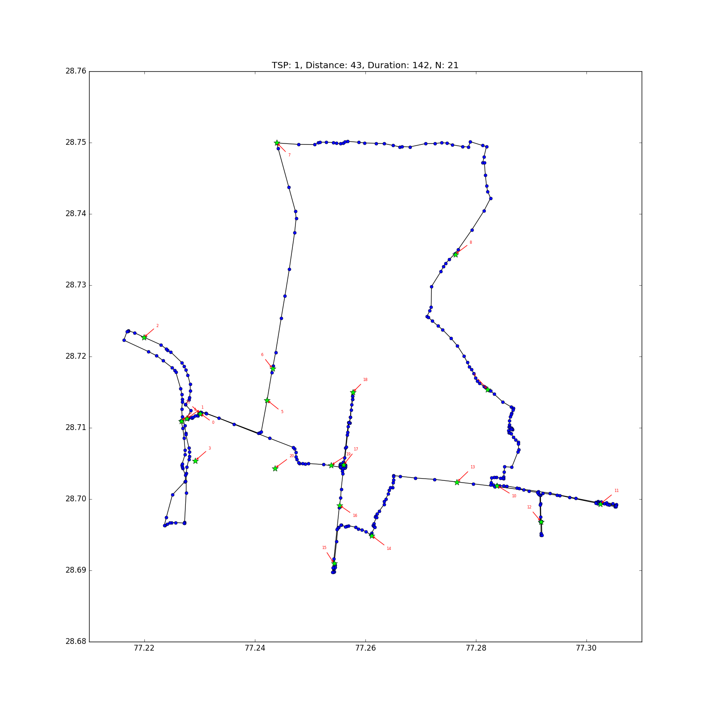
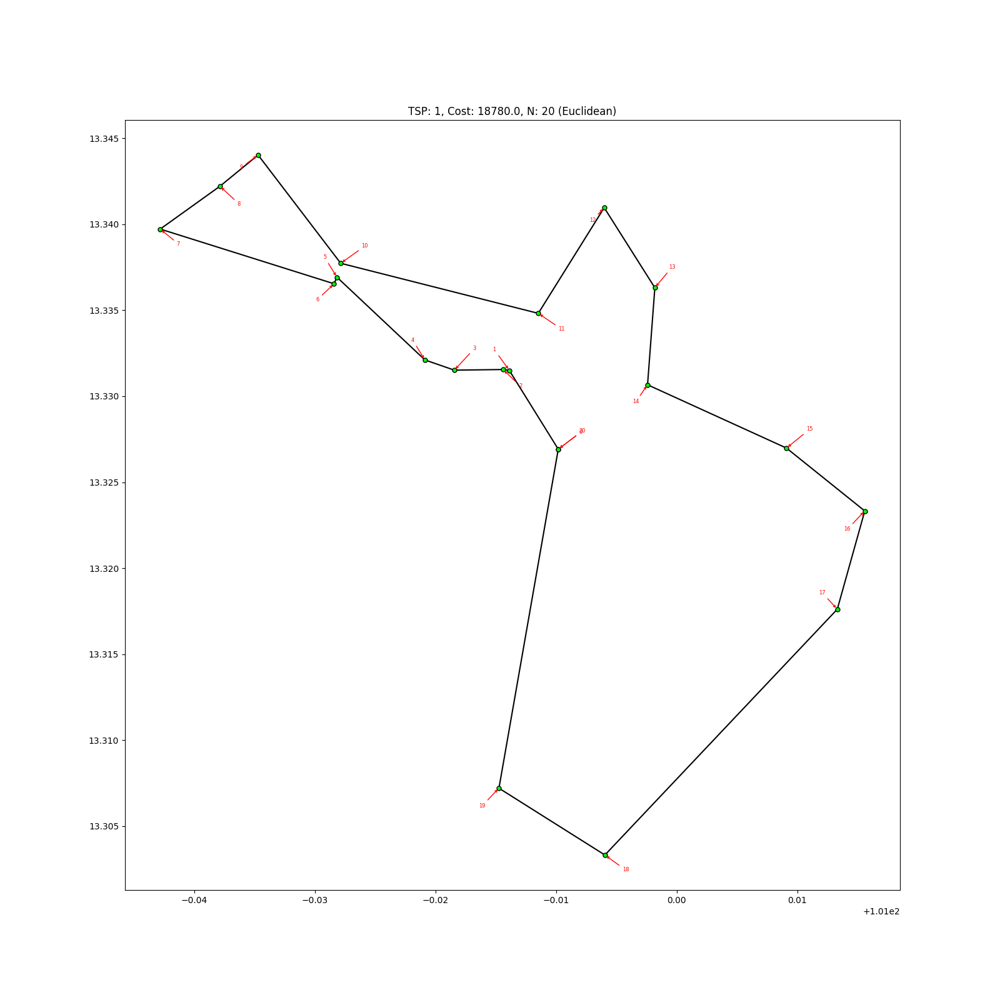
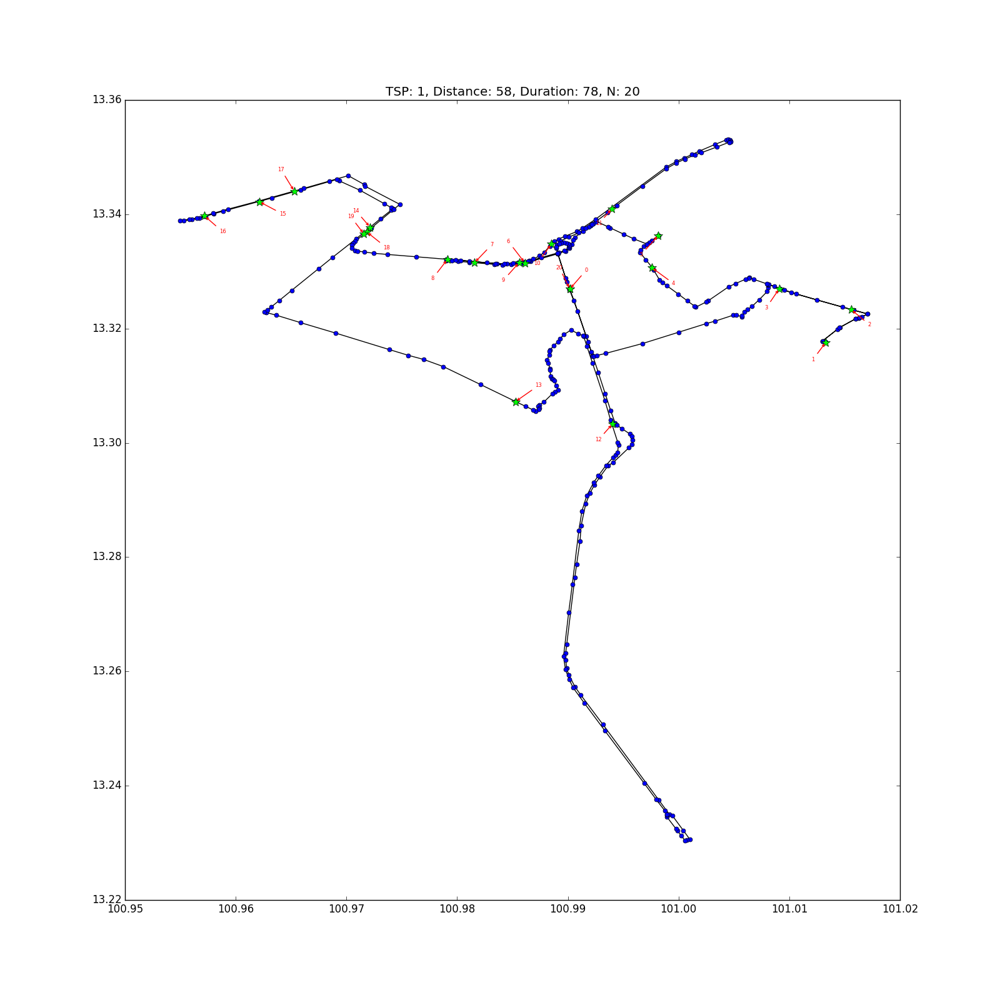

Google Maps Directions API Shortest path
============================================

Calculates the route using the `Google Maps Directions API <https://developers.google.com/maps/documentation/directions/>`__.

**Requirements**

Python client to the Google Maps API:

::

    pip install googlemaps

**Usage**

::

    usage: shortest_path_gm.py [-h] [-i INIT_LOCATION] [-o OUTPUT] [--plot]
                            [--save-plot SAVE_PLOT] --api-key API_KEY
                            input

    Shortest Path for across points assigned

    positional arguments:
    input                 Worker assigned road segments file

    optional arguments:
    -h, --help            show this help message and exit
    -i INIT_LOCATION, --init-location INIT_LOCATION
                            First segment_id to start from each worker
    -o OUTPUT, --output OUTPUT
                            Output file name
    --plot                Plot the output
    --save-plot SAVE_PLOT
                            Save plotting to file
    --api-key API_KEY     Google Map API Key

You can get the API key from this `link <https://developers.google.com/maps/documentation/directions/get-api-key>`__.

Please also look at the `API usage limit <https://developers.google.com/maps/documentation/directions/usage-limits>`__.

**Examples**

For Delhi, India:

::

    python -m allocator.shortest_path_gm allocator/examples/delhi-buffoon-n50.csv --save-plot allocator/examples/GM-buffoon/delhi/delhi.png -o allocator/examples/delhi-buffoon-shortest-gm.csv --api-key='...'

The route will look like the following:

:download:`CSV output <../../allocator/examples/delhi-buffoon-shortest-gm.csv>`

In this case, `cost` will be split into `distance` (in kilometers) and `duration` (in minutes).

For Chonburi, Thailand:

Using Buffoon allocate 50 clusters:

::

    python -m allocator.cluster_kahip -n 50 --n-closest 5 --buffoon allocator/examples/chonburi-roads-1k.csv -o allocator/examples/chonburi-buffoon-n50.csv

Using TSP solver:

::

    python -m allocator.shortest_path_ortools allocator/examples/chonburi-buffoon-n50.csv --save-plot allocator/examples/TSP-ortools-buffoon/chonburi/chonburi-tsp.png -o allocator/examples/chonburi-buffon-shortest-ortools-tsp.csv

And using Google Maps Direction API:

::

    python -m allocator.shortest_path_gm allocator/examples/chonburi-buffoon-n50.csv --save-plot allocator/examples/GM-buffoon/chonburi/chonburi-gm.png -o allocator/examples/chonburi-buffoon-shortest-gm.csv --api-key='...'

The route will look like the following:

:download:`CSV output <../../allocator/examples/chonburi-buffoon-shortest-gm.csv>`
