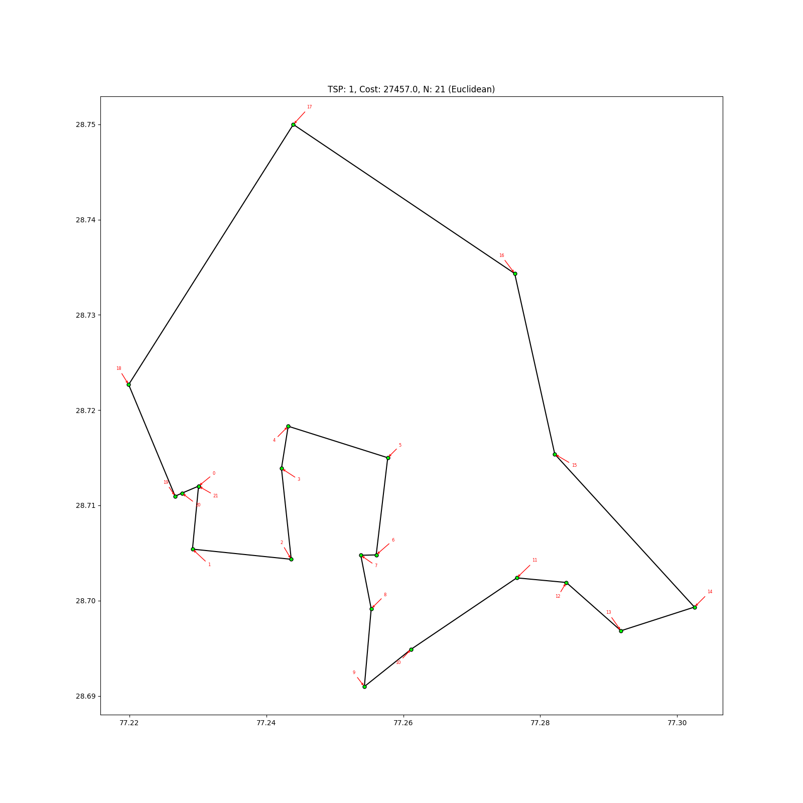
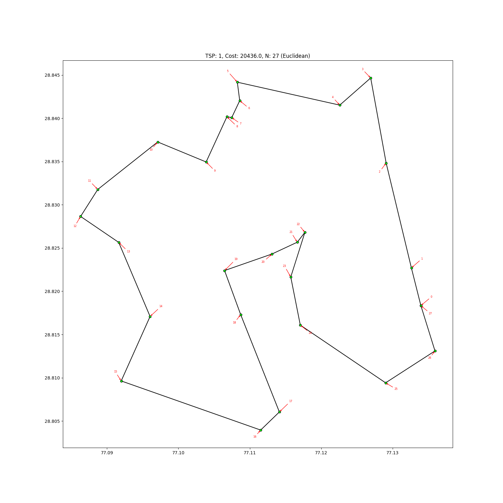

Google OR Tools TSP solver Shortest path
============================================

Uses the `TSP solver <https://developers.google.com/optimization/routing/tsp/tsp>`__ in `Google Optimization Tools <https://developers.google.com/optimization/>`__.

**Requirements**

Python client to Google OR Tools:

::

    easy_install ortools

**Usage**

::

    usage: shortest_path_ortools.py [-h] [-i INIT_LOCATION] [-o OUTPUT]
                                    [-d {euclidean,haversine,osrm}] [--plot]
                                    [--save-plot SAVE_PLOT] [--save-map SAVE_MAP]
                                    [--osrm-base-url OSRM_BASE_URL]
                                    [--osrm-max-table-size OSRM_MAX_TABLE_SIZE]
                                    input

    Shortest Path for across points assigned

    positional arguments:
      input                 Worker assigned road segments file

    optional arguments:
      -h, --help            show this help message and exit
      -i INIT_LOCATION, --init-location INIT_LOCATION
                            First segment_id to start from each worker
      -o OUTPUT, --output OUTPUT
                            Output file name
      -d {euclidean,haversine,osrm}, --distance-func {euclidean,haversine,osrm}
                            Distance function for distance matrix
      --plot                Plot the output
      --save-plot SAVE_PLOT
                            Save plotting to file
      --save-map SAVE_MAP   Save map to HTML file
      --osrm-base-url OSRM_BASE_URL
                            Custom OSRM service URL
      --osrm-max-table-size OSRM_MAX_TABLE_SIZE
                            Maximum OSRM table size

**Examples**

Run the script to solve TSP for each cluster:

::

    python -m allocator.shortest_path_ortools allocator/examples/delhi-buffoon-n50.csv --save-plot allocator/examples/TSP-ortools-buffoon/delhi/delhi-tsp.png -o allocator/examples/delhi-buffoon-shortest-ortools-tsp.csv

The TSP route will look like the following:

Run the script to solve TSP for each cluster:

::

    python -m allocator.shortest_path_ortools allocator/examples/delhi-kmeans-n50.csv --save-plot allocator/examples/TSP-ortools-kmeans/delhi-tsp.png --save-map allocator/examples/TSP-ortools-kmeans/map/delhi-tsp.html -o allocator/examples/delhi-kmeans-shortest-ortools-tsp.csv

The TSP route will look like the following:

We can see actual route on OpenStreet Map if ``--save-map`` option is specified and will looks like :download:`this. <../../allocator/examples/TSP-ortools-kmeans/map/delhi-tsp-1.html>`
